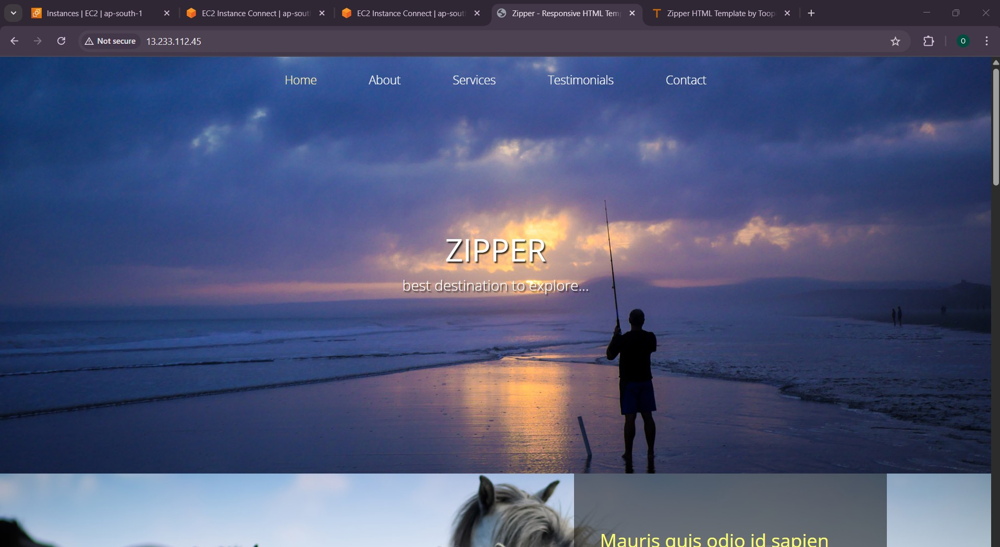
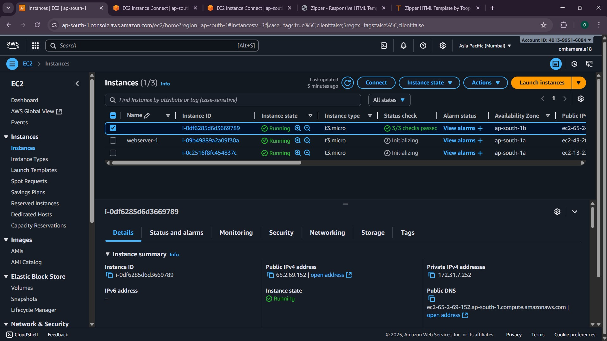
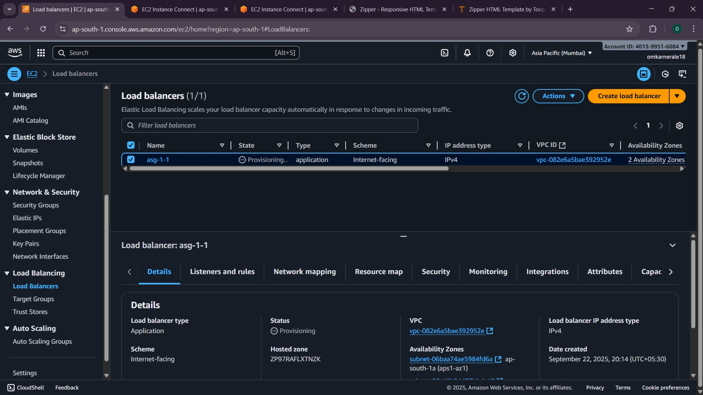
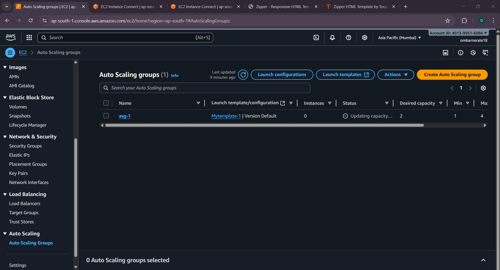

# Tooplate AWS Nginx Scalable Hosting

A production-ready deployment of a **Tooplate website** on **AWS** with a scalable and resilient architecture.  
This project is hosted using:

- **Nginx** as the web server
- **Custom VPC** with public/private subnets
- **EC2 instances** from an **AMI**
- **Elastic Load Balancer (ELB)** for traffic distribution
- **Auto Scaling Group (ASG)** for elasticity & high availability

---

## 🚀 Features
- Responsive Tooplate template  
- Hosted on **Nginx**  
- Scalable architecture with **Auto Scaling**  
- High availability via **Elastic Load Balancer**  
- Deployed inside custom **VPC + Subnets**  
- Infrastructure based on a reusable **AMI**  

---

## 📸 Screenshots

### Homepage

## AWS Architecture

### EC2 Instances

### Load Balancer

### AutoScaling Group

---

## 🛠️ Tech Stack
- **Frontend**: HTML, CSS, JavaScript (Tooplate template)  
- **Web Server**: Nginx  
- **Cloud Infra**: AWS VPC, Subnets, AMI, ELB, ASG  
- **OS**: Ubuntu  

---

